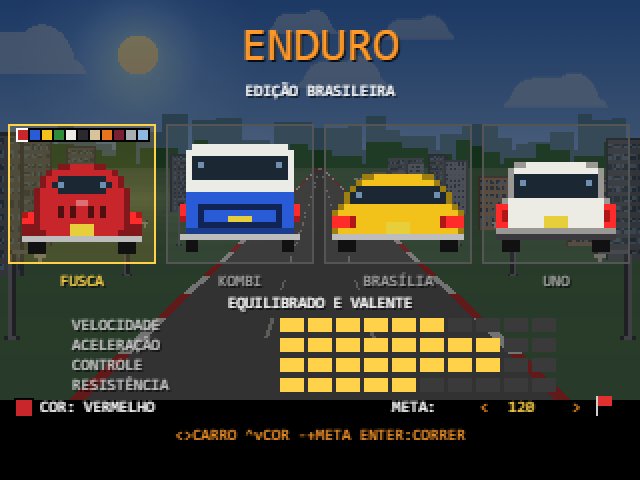
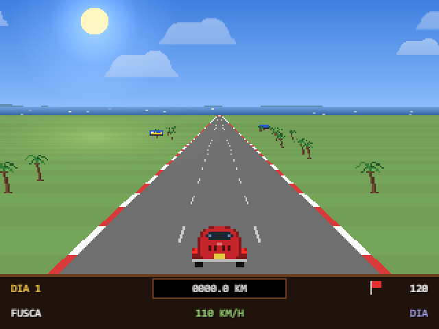
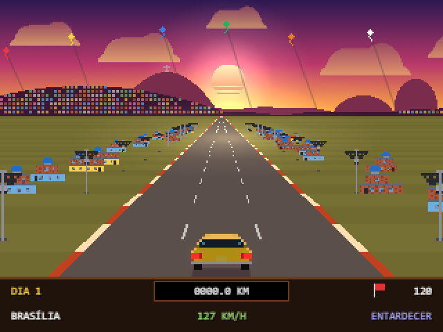
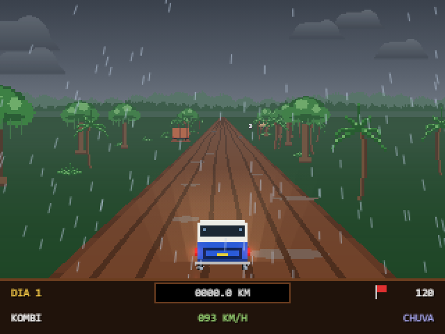
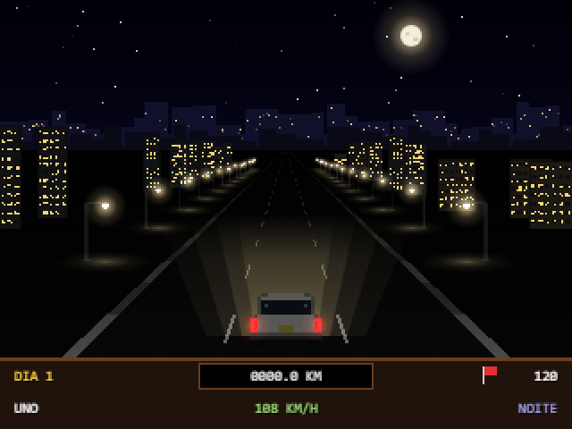
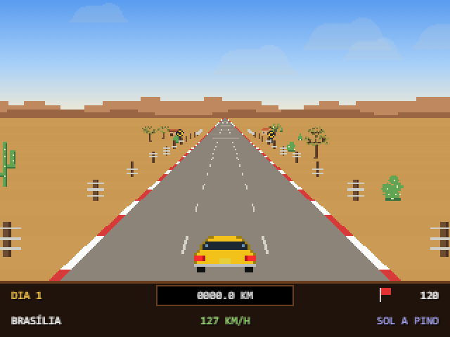
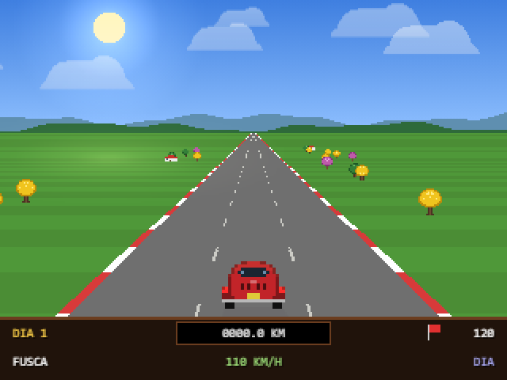

<div align="center">

# 🏁 ENDURO REMASTER
### Edição Brasileira

**Um remake do clássico _Enduro_ (Atari 2600) com Fusca, Kombi, Brasília e Uno,<br>estradas do Brasil, chuva, noite, neblina, lama e gado na pista.**




**[▶ Como jogar](#-como-jogar) · [🚗 Os carros](#-os-carros) · [🌎 Paisagens](#-paisagens) · [🛠 Desenvolvimento](#-desenvolvimento) · [🤝 Contribuindo](#-contribuindo)**

</div>

---

## ✨ Destaques

- 🚗 **4 carros brasileiros** com física própria, em **11 cores** clássicas (até o azul calcinha).
- 🌦 **Ciclo completo do dia:** dia → chuva → entardecer → noite → neblina → amanhecer.
- 🌎 **6 paisagens sorteadas** a cada dia, da Transamazônica ao sertão nordestino.
- 🎮 **Teclado, toque e controle USB** (estilo Super Nintendo ou Xbox/PlayStation) — funcionam juntos.
- 📦 **Zero dependências:** JavaScript puro + Canvas. Sem npm, sem bundler, sem framework.
- 🎨 **Nenhuma imagem no jogo:** os sprites são pixel-art desenhados em código e os sons são sintetizados com WebAudio.
- 📴 **Funciona offline**, num único arquivo HTML de ~140 KB que dá para mandar por WhatsApp.

## 🖼 Galeria

<table>
  <tr>
    <td align="center"><br><sub><b>Litoral</b> · dia</sub></td>
    <td align="center"><br><sub><b>Favela carioca</b> · entardecer, com pipas</sub></td>
  </tr>
  <tr>
    <td align="center"><br><sub><b>Transamazônica</b> · chuva e lama</sub></td>
    <td align="center"><br><sub><b>Cidade</b> · noite, só o facho do farol</sub></td>
  </tr>
  <tr>
    <td align="center"><br><sub><b>Sertão nordestino</b> · sol a pino</sub></td>
    <td align="center"><br><sub><b>Campo</b> · dia</sub></td>
  </tr>
</table>

---

## ▶ Como jogar

### Jogar agora

| Jeito | Passos |
|---|---|
| **Mais simples** | Baixe `dist/enduro-brasil.html` e dê duplo clique. É o jogo inteiro num arquivo só (scripts e fonte embutidos). |
| **A partir do código** | Clone o repositório e abra o `index.html` no navegador (duplo clique já funciona). |
| **Com servidor local** | `python -m http.server 8000` na pasta do projeto e acesse <http://localhost:8000>. |

```bash
git clone https://github.com/Douglas-Asilva/Enduro-Brasil.git
cd Enduro-Brasil
python -m http.server 8000
```

> 💡 O `index.html` carrega a fonte *Press Start 2P* do Google Fonts (sem internet, cai para `monospace`). O `dist/enduro-brasil.html` já leva a fonte embutida e não precisa de internet.

### 🎯 Objetivo

Ultrapasse a quantidade de carros indicada no painel (bandeira vermelha) **antes do dia acabar**. Ser ultrapassado devolve carros ao contador. Bateu a meta, passa para o próximo dia — e cada dia exige mais. Não bateu, fim de jogo.

**Meta ajustável:** no menu, use `-` / `+` (ou `Q` / `E`, ou clique nas setas de META) para escolher quantos carros ultrapassar no 1º dia: 30, 60, 90, **120 (padrão)**, 150, 200, 250 ou 300. Cada dia seguinte pede +1/3 da meta, até 2,5×. O recorde é guardado separadamente para cada meta.

### ⌨️ Teclado

| Tecla | Ação |
|---|---|
| `←` `→` / `A` `D` | Esterçar (no menu: escolher o carro) |
| `↑` `↓` no menu | Trocar a cor do carro |
| `-` `+` (ou `Q` `E`) no menu | Mudar a meta de ultrapassagens |
| `↑` / `W` / `Espaço` / `Z` | Acelerar |
| `↓` / `S` / `X` | Frear |
| `P` | Pausar |
| `M` | Som liga/desliga |
| `Esc` | Voltar ao menu |
| `C` no menu | Configurar o controle USB |

### 📱 Celular

O carro **acelera sozinho**. Use os botões **◀ ▶** (canto inferior esquerdo) para virar — dá para deslizar o dedo de um para o outro — e **FREAR** (canto inferior direito). O botão de pausa fica no canto superior direito.

No menu, toque num carro para escolhê-lo e toque de novo nele para largar; na pausa, toque na parte de baixo da tela para voltar ao menu. Jogue de preferência com o celular **deitado**.

### 🎮 Controle USB

Conecte o controle e aperte qualquer botão com o jogo aberto (o navegador só "enxerga" o controle depois disso). Teclado e controle funcionam juntos.

| Controle | Na corrida | No menu |
|---|---|---|
| Direcional `←` `→` | Esterçar | Escolher o carro |
| Direcional `↑` `↓` | Acelerar / frear | Trocar a cor |
| `B` (ou `A`) | Acelerar | Largar |
| `Y` | Frear | — |
| `L` / `R` | — | Diminuir / aumentar a meta |
| `Start` | Pausar / continuar | Largar |
| `Select` | Voltar ao menu | Configurar o controle |

Se algum botão não responder como esperado, aperte **Select** no menu (ou **C** no teclado) para abrir **CONFIGURAR CONTROLE**: o jogo pede cada ação e você aperta o botão correspondente. A configuração fica salva para aquele controle. `Esc` cancela, `Del` volta ao mapeamento automático.

Controles no padrão Xbox/PlayStation também funcionam, com analógico e gatilhos. Se o controle tiver vibração, ele vibra nas batidas.

---

## 🚗 Os carros

Cada carro tem velocidade, aceleração, controle e resistência diferentes.

| | Vel. máx. | Ponto forte | Ponto fraco |
|---|---|---|---|
| **Fusca** | 130 km/h | Equilibrado, bom em tudo | — |
| **Kombi** | 110 km/h | Aguenta batidas, firme na lama e nas curvas | Lenta e pesada |
| **Brasília** | 150 km/h | A mais veloz, passa mais carros | Escorrega e perde muito nas batidas |
| **Uno** | 128 km/h | Melhor aceleração e controle | Leve e frágil: sofre nas batidas, nas curvas e na lama |

**Pintura:** no menu, use `↑` `↓` (ou clique nas amostras no topo do quadro do carro) para escolher entre 11 cores clássicas — vermelho, azul, amarelo, verde, branco, preto, bege, laranja, vinho, prata e azul calcinha. A escolha de cada carro fica salva no navegador.

## 🌅 Fases do dia

Cada dia percorre seis fases:

**☀️ Dia** → **🌧 Chuva** *(ou* **🔥 Sol a pino** *no sertão)* → **🌇 Entardecer** → **🌙 Noite** *(só lanternas visíveis)* → **🌫 Neblina** → **🌄 Amanhecer**

- Na **chuva** a pista fica molhada (escorrega), as lanternas refletem no asfalto, os pneus levantam água e caem relâmpagos com trovão.
- À **noite** de longe só se veem as lanternas; de perto os carros viram silhuetas, e dentro do facho do farol eles aparecem com as cores reais.
- No **entardecer** e no **amanhecer** o sol fatiado, as nuvens com luz por baixo e as sombras compridas mudam o clima da pista.

## 🌎 Paisagens

A cada dia a estrada atravessa uma paisagem **sorteada** (até a do dia 1). O sorteio usa um "saco embaralhado": as 6 paisagens aparecem uma vez cada, em ordem aleatória, antes de qualquer uma voltar — então nenhuma repete em seguida e nenhuma fica de fora por muito tempo.

| | Paisagem | Beira da estrada | Horizonte | Clima |
|:-:|---|---|---|---|
| 🌳 | **Transamazônica** | castanheiras, palmeiras, samambaias, placa da BR, palafitas, caminhão atolado | copas da floresta com bruma | chuva |
| 🏖 | **Litoral** | coqueiros e casinhas | mar | chuva |
| 🏘 | **Favela carioca** | casas coloridas empilhadas com caixa d'água, postes com fios, orelhão | Corcovado com o Cristo, Pão de Açúcar e o morro coberto de casinhas (aceso à noite); pipas no céu | chuva |
| 🏙 | **Cidade** | prédios e postes de luz | silhueta de prédios (acesa à noite) | chuva |
| 🌼 | **Campo** | ipês amarelos e roxos, casinhas | morros suaves | chuva |
| 🌵 | **Sertão nordestino** | mandacarus, palmas, árvores da caatinga, cerca de arame, casas de taipa, cata-vento, placas de "gado na pista" | serrotes e chapadas marrom-alaranjados | sol a pino (miragem na pista) |

### 🟤 Transamazônica: lama e buracos

A pista é de **lama**, sem faixas pintadas: só ruas de pneu e poças. O carro acelera menos e escorrega mais (a Kombi, pesada, sofre menos; o Uno, leve, sofre mais), os pneus jogam lama, e há **buracos** espalhados pela estrada. Cair num buraco tira velocidade (a Kombi perde menos), joga o carro para o lado e sacode a tela — quanto maior o buraco, pior. À noite os buracos só aparecem no facho do farol.

### 🐄 Sertão: vacas e cavalos na pista

O chão é seco e amarelado e a fase **SOL A PINO** ocupa o lugar da chuva, com o céu esbranquiçado e a miragem tremendo no asfalto. **Vacas e cavalos andam pela pista**: alguns atravessam devagar, vindos do acostamento, outros ficam parados no meio de uma faixa. Bater num animal derruba muito a velocidade (mais que uma batida de carro) e joga o carro para o lado, então é preciso desviar. Os carros do tráfego também desviam deles. À noite os animais só aparecem no facho do farol — de longe, só o brilho dos olhos.

---

## 🛠 Desenvolvimento

O jogo é feito em **JavaScript puro (ES2020) + Canvas**, sem dependências. Para mexer, basta um editor de texto e um navegador — não há `npm install`.

### Estrutura do projeto

```text
enduro-remaster/
├── index.html              # Canvas, CSS, botões de toque e ordem de carga dos scripts
├── src/
│   ├── sprites.js          # Sprites pixel-art dos carros e objetos da estrada (definidos em código)
│   ├── audio.js            # Som sintetizado com WebAudio (motor, batida, chuva, trovão, jingles)
│   ├── gamepad.js          # Suporte a controle USB (Gamepad API) e tela de configuração
│   └── game.js             # Constantes, fases do dia, paisagens, física, IA do tráfego, render e entrada
├── assets/
│   └── PressStart2P-latin.woff2   # Fonte embutida na versão de distribuição
├── build.py                # Gera o arquivo único dist/enduro-brasil.html
├── dist/
│   └── enduro-brasil.html  # O jogo inteiro num arquivo só, pronto para compartilhar
└── docs/img/               # Capturas de tela usadas neste README
```

### Regras do código

Estas convenções mantêm o jogo abrindo com duplo clique (`file://`) e o build simples:

- **Sem bundler, sem npm, sem frameworks** e **sem ES modules** (`import`/`export`): os scripts são clássicos, compartilham escopo global e são carregados em ordem no `index.html`.
- **Resolução interna fixa de 320×240**, escalada por CSS com `image-rendering: pixelated`. Desenhe em pixels inteiros (`Math.round`).
- **Sem assets binários no jogo:** sprites em código, sons sintetizados.
- **Interface em português do Brasil, em maiúsculas.**
- Funções e constantes usadas no carregamento do script precisam estar definidas *antes* de quem as usa (`const` não é "içada").

### Como o jogo funciona por dentro

- **Pista pseudo-3D** renderizada por scanline; as curvas deslocam o topo da pista e aplicam força centrífuga no carro.
- **Carros** definidos só pela metade esquerda em strings e espelhados, o que garante simetria. Cores (`B` carroceria, `W` vidro, `R` lanternas, ...) ficam na paleta de `src/sprites.js`.
- **Fases do dia** (`PHASES`), **paisagens** (`THEMES`) e **carros** (`CARS`) são tabelas de dados no topo do `src/game.js` — o jeito mais fácil de começar a mexer.
- **Objetos da beira da estrada** ficam presos ao mundo: o sorteio é determinístico por vaga (função `hash`), sem estado guardado.
- **Progresso salvo** no `localStorage` do navegador (recordes por meta, cor de cada carro, meta escolhida e mapeamento do controle), sempre dentro de `try/catch`, então o jogo funciona mesmo sem armazenamento.

### Gerar o arquivo único para compartilhar

Depois de mudar o jogo, gere de novo o `dist/enduro-brasil.html` (requer Python 3, sem bibliotecas extras):

```bash
python build.py
```

O script embute os scripts de `src/` (na mesma ordem do `index.html`) e a fonte em base64, e **falha** se sobrar alguma referência externa. Adicionou um script novo em `src/`? Basta incluí-lo no `index.html`.

### 🎨 Ideias para começar

- 🗺 Criar uma nova **paisagem** (Pantanal? Serra gaúcha? Rodovia com pedágio?) adicionando uma entrada em `THEMES` e os sprites em `PROPS`.
- 🚙 Adicionar um **carro novo** (Gol, Chevette, Opala, Corcel...) em `CARS` e o sprite em `src/sprites.js`.
- ⚖️ **Balancear** velocidade, aderência e dano dos carros.
- 🔊 Melhorar os **sons** e a trilha.
- 📱 Testar em outros celulares e controles e ajustar o mapeamento.
- 🌐 Publicar no **GitHub Pages** para jogar direto pelo navegador, sem baixar nada.

---

## 🤝 Contribuindo

Contribuições são muito bem-vindas — de um bug corrigido a uma paisagem nova.

1. Faça um **fork** do repositório e crie uma branch: `git checkout -b minha-feature`.
2. Faça suas mudanças seguindo as [regras do código](#regras-do-código) e teste no navegador (teclado **e** toque, se mexeu em controles).
3. Rode `python build.py` para atualizar o `dist/enduro-brasil.html`.
4. Faça o commit e abra um **Pull Request** explicando o que mudou e, se for visual, com uma captura de tela.

Encontrou um bug ou tem uma ideia? Abra uma **issue** contando o navegador, o dispositivo e, se possível, como reproduzir.

> 🤖 O repositório inclui um agente do Claude Code em `.claude/agents/enduro-game-dev.md`, especializado neste projeto, que conhece a arquitetura e as convenções. Use-o para novas features, sprites e balanceamento.

## 🙏 Créditos e avisos

- Inspirado no **Enduro** (Activision, 1983, Atari 2600), de Larry Miller. Este é um projeto de fã, sem fins lucrativos e sem qualquer vínculo com a Activision.
- Fusca, Kombi, Brasília e Uno são referências a carros que fazem parte da memória de várias gerações de brasileiros; nomes e modelos pertencem aos seus respectivos fabricantes.
- Fonte **Press Start 2P**, de CodeMan38, sob a [SIL Open Font License 1.1](https://scripts.sil.org/OFL).

<div align="center">

Feito com 💛💚 e nostalgia de fliperama.<br>
Se curtiu, deixe uma ⭐ no repositório!

</div>
